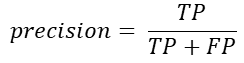
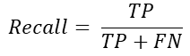
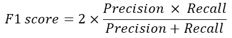
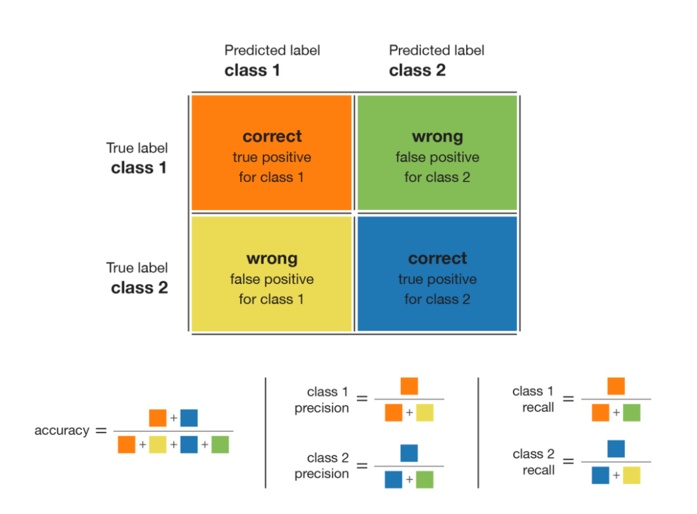
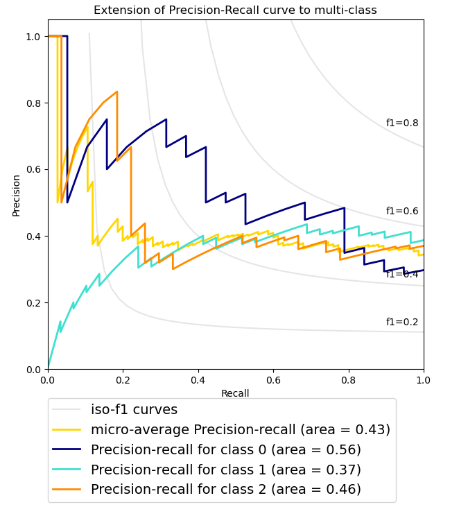
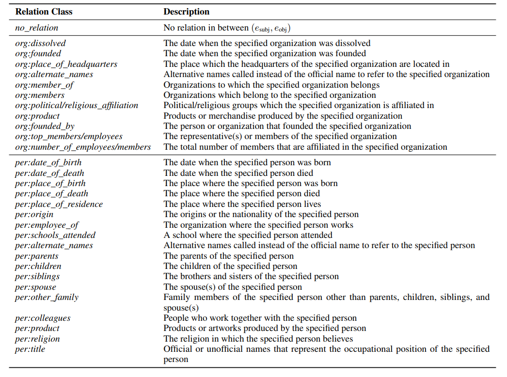
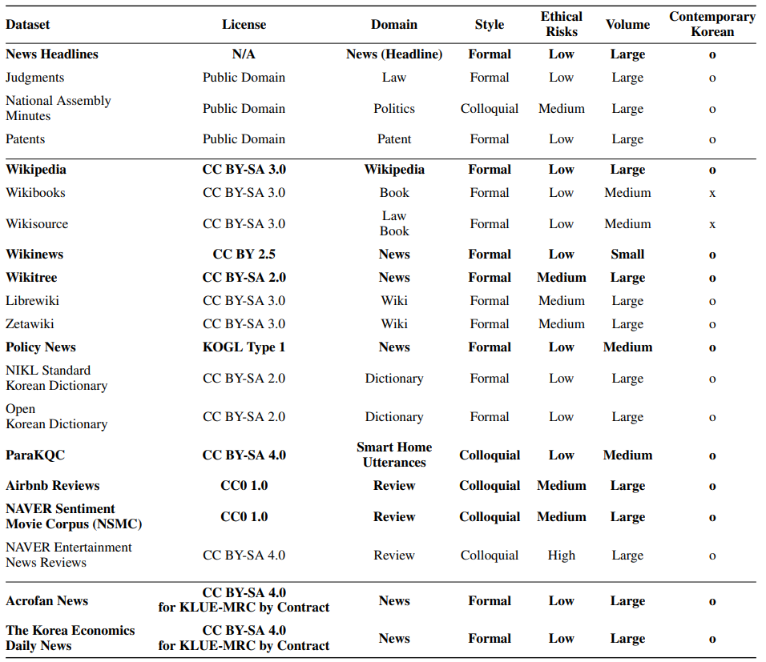

# 🐧 자, 연어 한접시's Second P-Stage Project 🐧

BoostCamp AI Tech 3th. KLUE 문장 분류 Task

## Index

- [🐧 자, 연어 한접시's Second P-Stage Project 🐧](#-자-연어-한접시s-second-p-stage-project-)
  - [Index](#index)
  - [Competition Overview](#competition-overview)
    - [Background](#background)
    - [Target](#target)
    - [Dataset](#dataset)
  - [Dev Environment](#dev-environment)
  - [Project Tree](#project-tree)
  - [Usage](#usage)
    - [Train option](#train-option)
    - [Inference](#inference)
    - [Ensemble](#ensemble)
  - [Wrap Up Report](#wrap-up-report)
  - [Reference & License](#reference--license)

## Competition Overview

### Background

> 문장 속에서 단어간 관계성을 파악하는 것은 의미나 의도를 해석함에 있어서 많은 도움을 줍니다. 요약된 정보를 활용하여 QA 시스템 구축을 하거나, 자연스러운 대화가 이어질 수 있도록 하는 바탕이 되기도 합니다. 
이처럼 관계 추출(Relation Extraction)은 문장의 단어(Entity)에 대한 속성과 관계를 예측하는 Task입니다. 관계 추출은 지식 그래프를 구축하기 위한 핵심으로 구조화된 검색, 감정분석, 질의응답, 요약과 같은 다양한 NLP task의 기반이 됩니다.

### Target

> 이번 competition 에서는 한국어 문장과 subject_entity, object_entity가 주어졌을 때, entity 간의 관계를 추론하는 모델을 학습시키게 됩니다. 아래는 예시입니다.

```
sentence: 오라클(구 썬 마이크로시스템즈)에서 제공하는 자바 가상 머신 말고도 각 운영 체제 개발사가 제공하는 자바 가상 머신 및 오픈소스로 개발된 구형 버전의 온전한 자바 VM도 있으며, GNU의 GCJ나 아파치 소프트웨어 재단(ASF: Apache Software Foundation)의 하모니(Harmony)와 같은 아직은 완전하지 않지만 지속적인 오픈 소스 자바 가상 머신도 존재한다.
subject_entity: 썬 마이크로시스템즈
object_entity: 오라클

relation: 단체:별칭 (org:alternate_names)
```

- input: sentence, subject_entity, object_entity
- output: pred_label, probs

### Evaluation
> KLUE-RE evaluation metric과 동일한 micro F1-score와 AUPRC를 evaluation metric으로 사용합니다.
- Micro F1 score
  - micro-precision과 micro-recall의 조화 평균이며, 각 샘플에 동일한 importance를 부여해, <u>샘플이 많은 클래스에 더 많은 가중치를 부여</u>합니다. 
  - 데이터 분포상 많은 부분을 차지하고 있는 **no_relation class는 제외**하고 F1 score가 계산 됩니다.
  
  
  
  
- AUPRC
  - x축은 **Recall**, y축은 **Precision**이며, 모든 class에 대한 평균적인 AUPRC로 계산해 score를 측정 합니다. imbalance한 데이터에 유용한 metric 입니다.
  
  - 위 그래프의 예시는 scikit-learn의 Precision-Recall 그래프의 [예시](https://scikit-learn.org/stable/auto_examples/model_selection/plot_precision_recall.html#sphx-glr-auto-examples-model-selection-plot-precision-recall-py) 입니다. 그림의 예시와 같이 class 0, 1, 2의 area(면적 값)을 각각 구한 후, 평균을 계산한 결과를 AUPRC score로 사용합니다.

### Dataset

- train.csv: 총 32470개
- test_data.csv: 총 7765개 (label blind)
- dict_label_to_num.pkl: 문자 label과 숫자 label로 표현된 dictionary
- dict_num_to_label.pkl: 숫자 label과 문자 label로 표현된 dictionary
- data 예시
  
- relation 구성 정보
  

대회 평가 데이터의 경우 Public(진행 중)과 Private(종료 후)로 구성되어 있으며, 각각 50% 비율로 무작위로 선정되었습니다.

## Dev Environment

- CPU: Intel(R) Xeon(R) Gold 5120 CPU @ 2.20GHz
- GPU: Tesla V100-PCIE-32GB
- OS: Ubuntu 18.04.5 LTS
- IDE: Jupyter notebook, VSCode
- Tools: Github, Notion, Zoom, wanDB

## Project Tree

```
level2-klue-level2-nlp-06
├── EDA
│ ├── 001_EDA.ipynb
│ └── 002_cm_EDA.ipynb
├── dataset
│ ├── test_data.csv
│ ├── train.csv
│ ├── train_btl_eng_pos400_comb300.csv
│ └── train_entity850.csv
├── src
├── utils
│ ├── back_translation
│ │   ├── backTraslation.ipynb
│ │   └── index_modify.ipynb
│ └── postag
│     ├── aug_postage.py
│     └── pos_scaling.ipynb
├── dict_label_to_num.pkl
├── dict_num_to_label.pkl
├── ensemble.py
├── inference_gpt.py
├── inference.py
├── load_data.py
├── README.md
├── requirements.txt
└── train.py
```

- `EDA/`: 진행한 데이터 분석을 저장한 디렉토리
- `dataset/`: 이번에 쓰인 원본 데이터셋을 포함, augmentation이 적용된 데이터셋이 저장된 디렉토리
  - `train_pos400`: pos-tagging을 400개 미만의 데이터에 적용
  - `train_btl_eng_pos400_comb300.csv`: Back translation과 pos-tagging 적용
  - `train_entity850.csv`: 데이터 갯수가 850개 미만인 경우 augmentation을 진행
- `utils/`: 데이터 전처리 및 augmentation과 관련된 모듈
  - `bacTranslation.ipynb`: 웹 크롤링을 이용한 back translation
  - `index_modify.ipynb`: back translation 결과 수정된 entity의 idex를 재수정
  - `aug_postage.py`: 토큰화 및 pos-tagging
  - `pos_scaling.ipynb`: pos-tagging을 이용한 형용사/부사 제거 문장 (RD)
- `ensemble.py`: soft-voting ensemble
- `inference_gpt.py`: gpt 계열 모델의 inference
- `inference.py`: robert 계열 모델의 inference
- `load_data.py`: dataset 클래스
- `train.py`: 모델 학습 코드. k-fold 포함

## Usage

### Train option

- 모델을 학습시킵니다.
- k-fold 유무를 선택하여 진행할 수 있으며, wandb와 연결이 되어있습니다.
  - wandb 설정 변경은 코드를 변경해주세요
- 기본적으로 `./dataset/` 디렉토리의 csv파일을 입력으로 받으며, best model을 `./best_model`에 저장합니다.
  - check-point의 경우에는 500 step마다 eval을 거친 후 저장됩니다.

```
python train.py -h
```

|   argument   | description                                                                  | default             |
| :----------: | :--------------------------------------------------------------------------- | :------------------ |
|   dataset    | 학습 데이터셋 선택                                                           | ./dataset/train.csv |
|  model_name  | 사용할 모델 선택(checkpoint)                                                 | klue/roberta-large  |
|  batch_size  | batch size 설정                                                              | 16                  |
|    k_fold    | K Fold 사용 유무                                                             | False               |
|   fold_num   | K Fold number 설정                                                           | 5                   |
|    epoch     | epochs 설정                                                                  | 5                   |
|    lr_sch    | LR 스케줄러 설정                                                             | linear              |
| wandb_entity | wandb 사용 시 entity                                                         | user-name           |
|     name     | wandb 사용 시 표시할 실험 이름. 기본규칙: 모델명-kfold유무-사용데이터셋-기타 | new test            |
|  case_name   | 모델을 저장할 로컬 폴더의 이름                                               | last                |

### Inference

- 모델의 inference를 진행합니다.
- 결과는 `./prediction/submission.csv` 형태로 저장됩니다.
- gpt의 경우에는 inference_gpt.py를 이용합니다.

```
python inference.py -h
```

| argument  | description           | default            |
| :-------: | :-------------------- | :----------------- |
| model_dir | inference할 모델 위치 | ./best_model       |
|   model   | 사용할 모델 선택      | klue/roberta-large |

### Ensemble

- soft-voting Ensemble을 진행합니다.
- 모델의 각 inference 결과를 취합하여 `./prediction/ensemble.csv`에 저장합니다.

```
python ensemble.py -h
```

|    argument    | description                                 | default      |
| :------------: | :------------------------------------------ | :----------- |
| prediction_dir | soft-voting 적용할 prediction이 저장된 위치 | ./collection |

## Wrap Up Report

Task를 수행하면서 시도했던 실험과 결과, 회고는 [WrapUp Report](https://github.com/boostcampaitech3/level2-klue-level2-nlp-06/blob/main/src/KLUE_NLP_%ED%8C%80%20%EB%A6%AC%ED%8F%AC%ED%8A%B8(06%EC%A1%B0).pdf)에서 확인할 수 있습니다.

## Reference & License

- Paper
  - [KLUE: Korean Language Understanding Evaluation](https://arxiv.org/abs/2105.09680)
- Dataset
  
